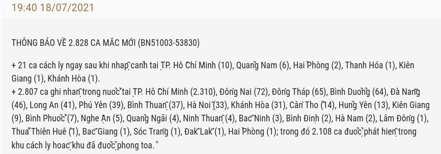
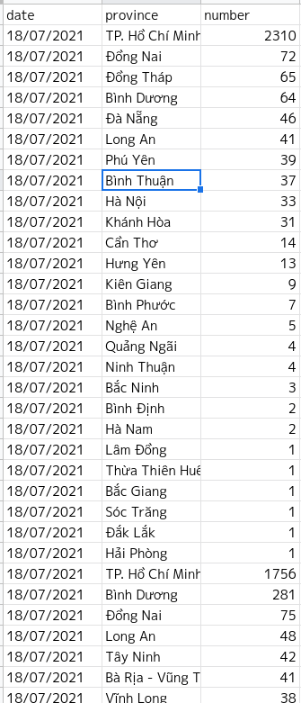
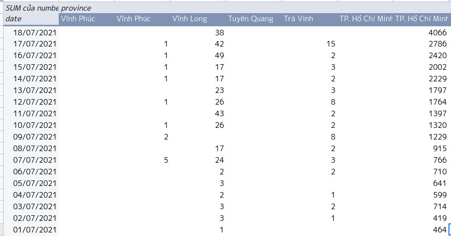
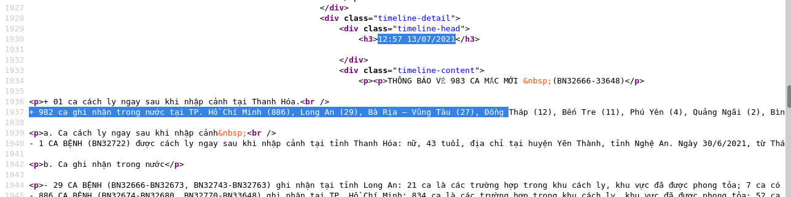

## Ý tưởng parsing ban đầu.
1. Bộ y tế có một trang dòng thời gian, đăng các thông báo về diễn biến dịch COVID-19. Các dòng thông báo này cập nhật đều đặn và update hơn các chỉ số khác: https://ncov.moh.gov.vn/dong-thoi-gian
2.Trong đợt dịch thứ 4, bộ thường mở đầu thông báo bằng vài dòng thống kê về số ca nhiễm trong ngày với cú pháp như sau: 
3. Đoan text này có thể search với regex pattern như sau: ```(?:(?:,|(?:tại)):?\s*([^\d\(]+) \((\s?\d+(?:\.\d+)?\s?)\))``` nên repo này đã có một static web app nho nhỏ để nhận đoạn text trên và xuất ra danh sách ca nhiễm theo từng tỉnh. https://truongan.github.io/T4C-news-parsing-regex/
4. Thông tin số ca mắc trong từng tỉnh, kèm với ngày thông báo tương ứng có thể dùng để tổng hợp thành bảng thống kê số ca mới mỗi ngày theo từng tỉnh bằng Pivot Table trong Google Sheet:



## Crawling
Xem xét cơ chế pagination trên trang 'dong-thoi-gian' của bộ thì thấy đường link đến từng page có dạng như sau:
```https://ncov.moh.gov.vn/web/guest/dong-thoi-gian?p_p_id=com_liferay_asset_publisher_web_portlet_AssetPublisherPortlet_INSTANCE_nf7Qy5mlPXqs&p_p_lifecycle=0&p_p_state=normal&p_p_mode=view&_com_liferay_asset_publisher_web_portlet_AssetPublisherPortlet_INSTANCE_nf7Qy5mlPXqs_delta=10&p_r_p_resetCur=false&_com_liferay_asset_publisher_web_portlet_AssetPublisherPortlet_INSTANCE_nf7Qy5mlPXqs_cur=2
```
Trong đó con số cuối cùng là số trang. Đường link pagination này khá phức tạp nhưng có vẻ như là cố định đối với mọi trang và chỉ thay đổi số trang sau cùng. Có thể viết một crawler đơn giản bằng các loop số trang từ *1 -> n*

Khi xem mã nguồn các trang time-line của bộ Y tế thấy các đoạn thông báo thường nằm cố định trong đoạn HTML có dạng sau:


Nhận xét thấy:
1. Các thông báo sẽ bắt đầu bằng một div có class là *timeline-head*
2. Nội dung cụ thể của thông báo sẽ nằm trong các tag `<p>`
3. Dòng thông báo chứa con số ca mắc cụ thể của từng tỉnh thường nằm trong tag `<p>` đầu tiên chứa từ khóa `trong nước` 

Như vậy có thể viết một cralwer đơn giản, tải từng trang con của `dong-thoi-gian` Sau đó parse HTML bằng beautiful soup để tìm từng tag `<p>`  tương ứng với mỗi thông báo và bắt ra đoạn nào chứa thông tin số ca mắc của từng tỉnh.

Mã nguồn crawler share trên notebook https://colab.research.google.com/drive/182nnFN4G_WkQ0qjWFtD7qUA_IlPEPIFU

Crawler trên sẽ tạo ra file . File này ghi nhận 2 cột
1. `immigrant` lưu dòng đầu tiên chứa từ khóa nhập cảnh trong thông báo. 
2. `domestic` lưu dòng đầu tiên chứa từ khóa "trong nước" trong thông báo
3. `date` lưu phần ngày trong `timeline-head`
4. `datetime` lưu phần ngày giờ thông báo trong `timeline-head`
5. `url` lưu đường link đến trang chứa thông báo đã crawl, dùng khi cần double check

## Parse crawled.csv

Dựa trên regex pattern ở phần đầu, có thể parse tự động file crawled.csv để tạo ra file `domestic.csv` chứa toàn bộ thông tin về số ca mắc mới của mỗi tỉnh trong mỗi thông báo. 
File `domestic.csv` này sau đó có thể được paste vào GSheet để sau đó dùng pivot table tổng hợp lại thành tổng số ca nhiễm mỗi ngày của mỗi tỉnh. 
Có 03 trường hợp đặc biệt từ file crawled.csv cần phải paste bằng tay vào GSheet vì file `domestic.csv` không chứa hết là các thông báo đặc biệt khi tất cả số ca mắc nằm ở cùng một tỉnh thì Bộ Y tế sẽ có cách viết thông báo hơi khác:
```
2021-06-09 12:48:00 Ghi nhận trong nước:
2021-05-10 12:00:00 - 31 ca mắc ghi nhận trong nước tại:
2021-05-07 06:05:00 Ghi nhận trong nước tại Thanh Hoá. Cụ thể: Bệnh nhân nam, 42 tuổi, địa chỉ tại thành phố Thanh Hóa, tỉnh Thanh Hóa. Bệnh nhân là F1 của chuyên gia Trung Quốc (nhập cảnh
2021-05-06 06:17:00 Ghi nhận trong nước tại Bệnh viện Bệnh Nhiệt đới Trung ương cơ sở Đông Anh, là các bệnh nhân đang điều trị tại bệnh viện.
```

Ngoài ra GSheet cũng cần được cleaning vì có nhiều tên tỉnh được viết ở nhiều dạng khác nhau. Ví dụ như tổng cộng bộ có 7 cách viết tên địa danh `TP. Hồ Chí Minh`